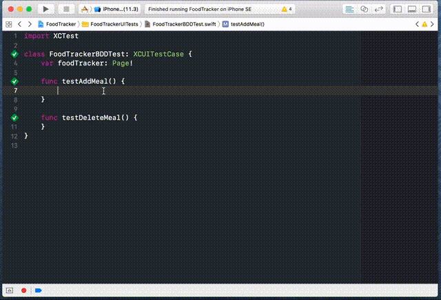

# clean and scalable xcuitest

Sample project of iOS UI test automation using XCUITest.

Sample App: [FoodTracker](https://developer.apple.com/library/content/referencelibrary/GettingStarted/DevelopiOSAppsSwift/)

## BDD Steps with Xcode Snippets


## Flexible app launcher
Test app with different locale
```swift
foodTracker = TestBuilder(app).setLocale("en_US").launch()
```

or with default locale
```swift
foodTracker = TestBuilder(app).launch()
```

## Page Objects
```swift
class MainPage {
  var app: XCUIApplication
  lazy var addButton = app.buttons["Add"].firstMatch

  required init(_ app: XCUIApplication) {
    self.app = app

    // wait for page ready
    waitFor(element: addButton, status: .exist)
  }

  func checkSomething() -> Self {
    // do assertion

    return self
  }

  func openPage() -> NextPage {
    // interacting with app

    return NextPage(app)
  }
}
```

## Fluent Interface
```swift
func testAddMeal() {
  foodTracker
    .on(page: MainPage.self).openAdd()
    .on(page: AddPage.self).addMeal(name: "Kung Pao Chicken").checkHasMeal(name: "Kung Pao Chicken")
}
```

## BDD with XCTContext
```swift
func testAddMeal() {
  Given("I am in Main screen") {
      foodTracker = TestBuilder(app).setLocale().launch()
  }

  When("I add meal with name 'Kung Pao Chicken'") {
      foodTracker.on(page: MainPage.self).openAdd().addMeal(name: "Kung Pao Chicken")
  }

  Then("I see 'Kung Pao Chicken' appear in Main screen") {
      foodTracker.on(page: MainPage.self).checkHasMeal(name: "Kung Pao Chicken")
  }
}
```


